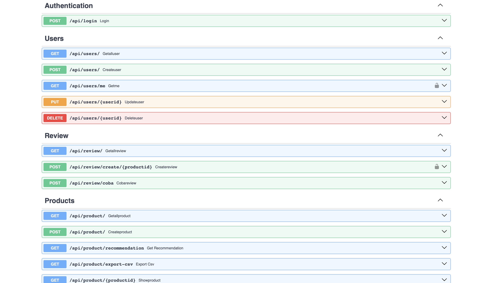
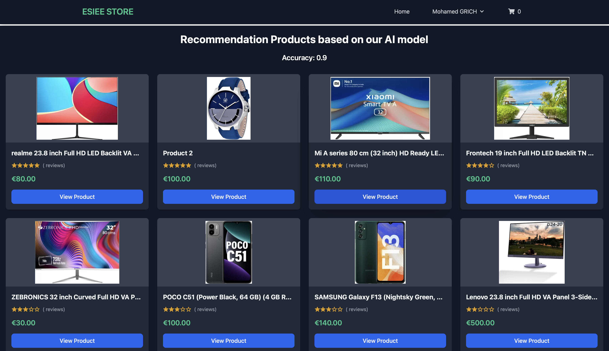
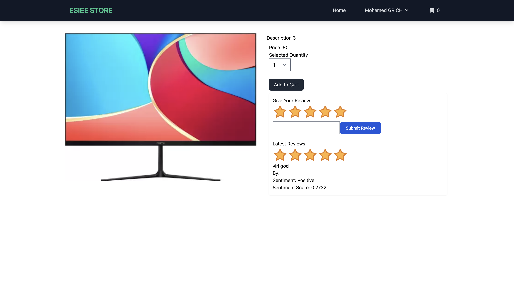
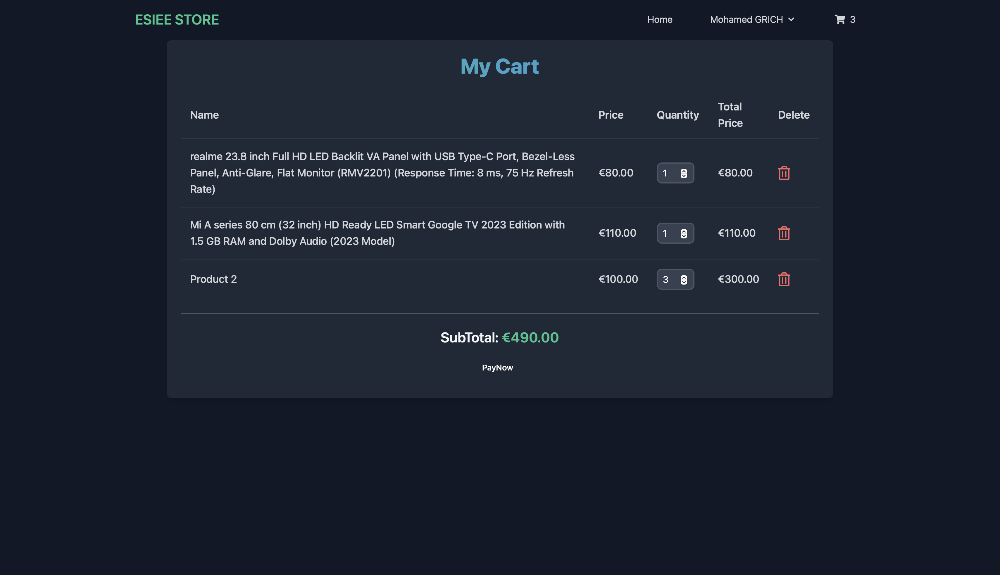
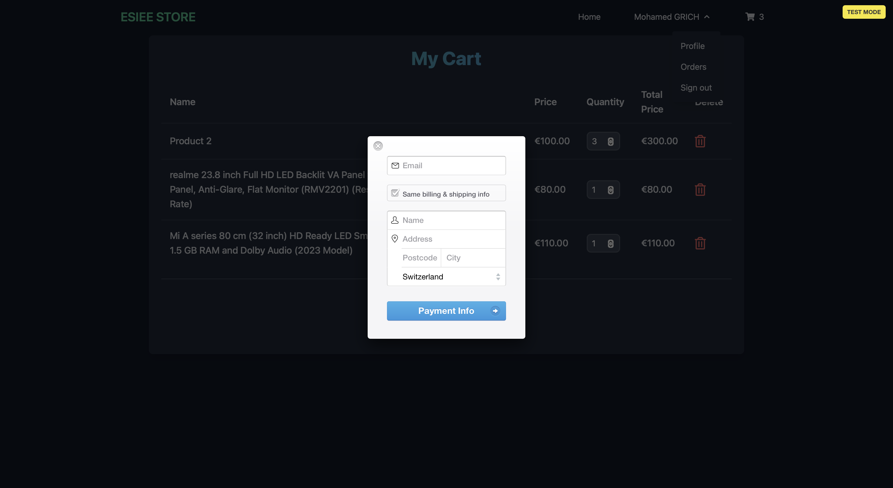
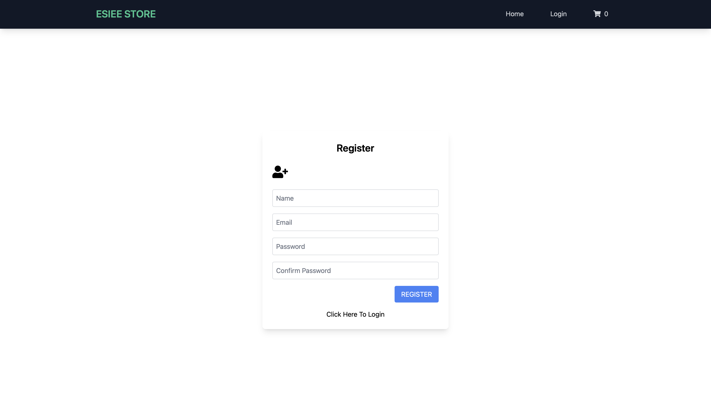
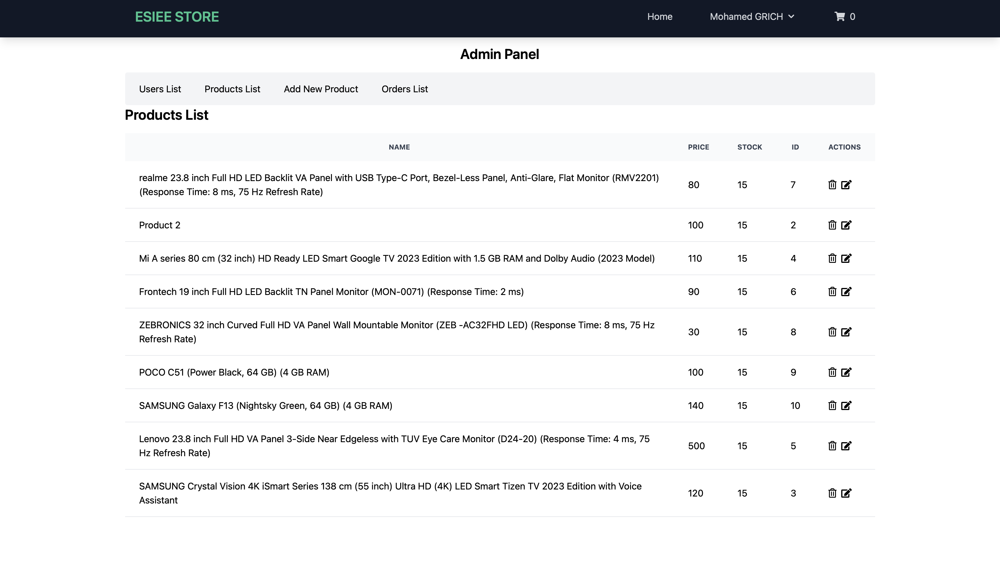
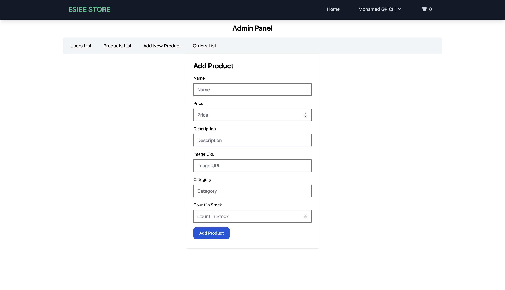
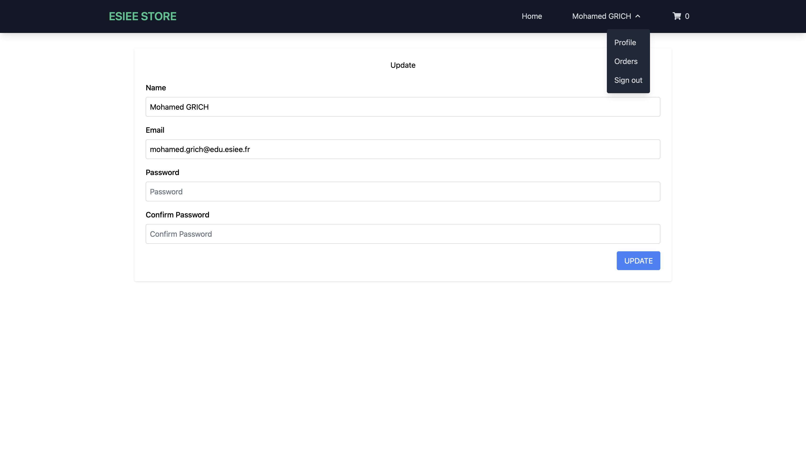

# Application d'E-commerce avec FastAPI et ReactJS

## Par : Mohamed GRICH et Abdlehak MAHFOUD

### Description du Projet

Notre projet consiste en une application d'e-commerce permettant de gérer des produits, des commandes, des clients, et des administrateurs. Le backend utilise FastAPI avec PostgreSQL et SQLAlchemy pour la gestion de la base de données, tandis que le frontend est développé avec ReactJS et Redux pour une gestion dynamique de l'état. Le projet inclut également l'utilisation de Docker pour containeriser l'application et faciliter son déploiement.

### Fonctionnalités

- **Gestion des produits** : Ajouter, modifier et supprimer des produits.
- **Gestion des commandes** : Suivre les commandes passées par les clients.
- **Gestion des utilisateurs** : Créer et administrer des comptes clients et administrateurs.
- **Panier d'achat** : Permet aux utilisateurs de gérer leurs produits dans un panier avant de finaliser l'achat.

### Difficultés rencontrées

- **Intégration de Docker** : Au début, l'intégration de Docker dans le projet était complexe, en particulier pour s'assurer que tous les services (backend, frontend et base de données PostgreSQL) étaient correctement configurés et communiquaient entre eux. 
- **Gestion des états dans React avec Redux** : La gestion de l'état global dans React avec Redux a posé quelques défis, notamment en ce qui concerne la gestion de l'authentification et la mise à jour des données des produits et commandes en temps réel.
- **Sécurisation de l'API** : La mise en place de JWT pour sécuriser les endpoints de l'API a nécessité une compréhension approfondie des mécanismes de gestion des tokens et des middleware pour l'authentification.

### Documentation de l'API du Backend

L'API du backend est accessible via la documentation Swagger à l'adresse suivante :  
[http://localhost:8000/docs](http://localhost:8000/docs)



### Comment utiliser notre projet ?

#### Prérequis

1. Installer **Python** (version 3.7 ou supérieure).
2. Installer **PostgreSQL** sur votre machine.
3. Installer **NPM** et **Node.js** pour le frontend.
4. Installer **Docker**.
4. Cloner notre projet à l'aide de Git :
   ```bash
   git clone https://github.com/JeroxGR/E5_FullStack_projet.git
    ```

#### Lancement

1. Lancez le projet avec la commande :
   ```bash
   docker-compose up --build
   docker-compose up
   ```

2. L'application sera accessible avec un lien locale qui apparait dans le terminal

#### Guide sur les fonctionnalitees
1. Il faut creer un compte avec le button registre afin d'acceder a toutes les fonctionnalitees
2. Vous pouvez acceder a l'interface des admins en utilisant le lien /admin
3. Afin d'utiliser le payment avec Stripe il faut configurer votre propre cle d'API

### Captures d'ecran de notre application
1. Page de garde


2. Page de Produit


3. Page de panier


4. Pop-up pour le payment avec Stripe


5. Page de creation de compte


6. Page d'Admin avec le pannel 


7. Page d'ajout de produit ( dans la partie Admin ) 


8. Page de mise a jour des infos d'utilisateur
